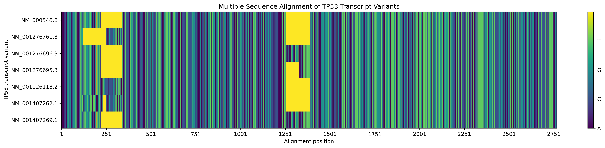
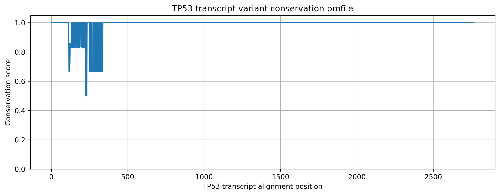
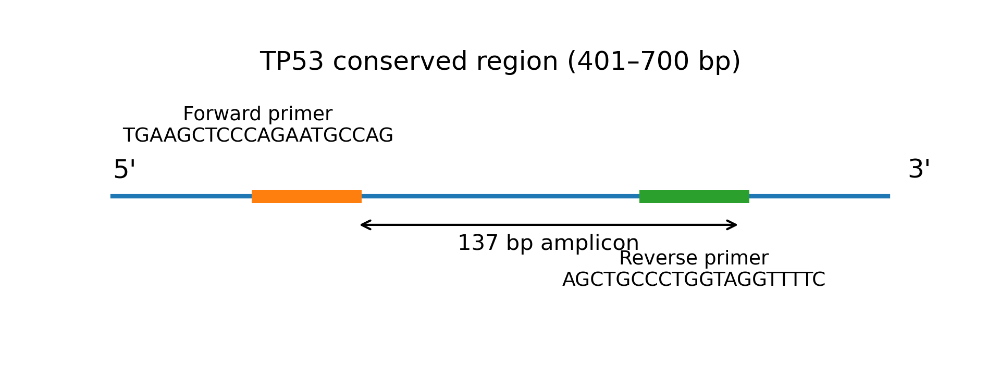
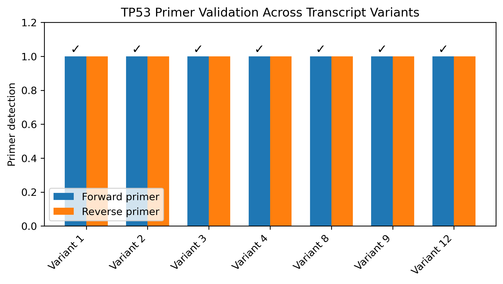

# TP53 Primer Design Across Transcript Variants

## Overview

This project focuses on designing and computationally validating a primer pair for TP53 expression analysis across multiple transcript variants.

The main goal was to identify a conserved region shared among TP53 transcript variants and design primers capable of amplifying this region.

---

## Biological Question

Can a primer pair be designed within a conserved region of TP53 that is shared across multiple transcript variants?

---

## Workflow

The analysis pipeline consisted of:

1. Collection of TP53 transcript variants
2. Multiple sequence alignment
3. Conservation analysis
4. Conserved region identification
5. Consensus sequence extraction
6. Primer design using Primer3
7. In-silico validation across transcript variants
8. Specificity evaluation

---

## Dataset

Seven human TP53 transcript variants were analyzed:

- NM_000546.6
- NM_001276761.3
- NM_001276696.3
- NM_001276695.3
- NM_001126118.2
- NM_001407262.1
- NM_001407269.1

Transcript sequences were aligned using multiple sequence alignment.

---

# Methods

## 1. Multiple Sequence Alignment

TP53 transcript variants were aligned to identify conserved nucleotide regions.

---

## 2. Conservation Analysis

A conservation profile was generated to identify highly conserved regions across the alignment.

---

## 3. Conserved Region Selection

A highly conserved region spanning positions 401–700 bp was selected as the template for primer design.

A consensus sequence was extracted from this region.

---

## 4. Primer Design

Primers were designed using Primer3 with the following parameters:

- Primer length: 18–24 bp
- Optimal length: 20 bp
- Optimal melting temperature: 60°C
- GC content: 40–60%
- Expected product size: 100–250 bp

---

## 5. Primer Validation

The selected primer pair was tested against all analyzed TP53 transcript variants.

Results:

- Forward primer detected: 7/7 variants
- Reverse primer detected: 7/7 variants
- Sequence mismatches: 0

---

# Final Primer Pair

| Primer | Sequence | Length | Tm | GC |
|---|---|---|---|---|
| Forward | TGAAGCTCCCAGAATGCCAG | 20 bp | 60.04°C | 55% |
| Reverse | AGCTGCCCTGGTAGGTTTTC | 20 bp | 59.96°C | 55% |

Expected amplicon size:

**137 bp**

---

# Tools

- Python
- Biopython
- SeqKit
- Clustal Omega
- Primer3
- Primer-BLAST

---

# Project Structure

