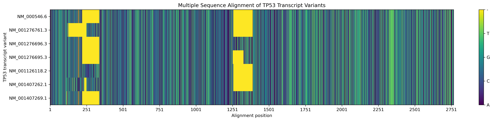
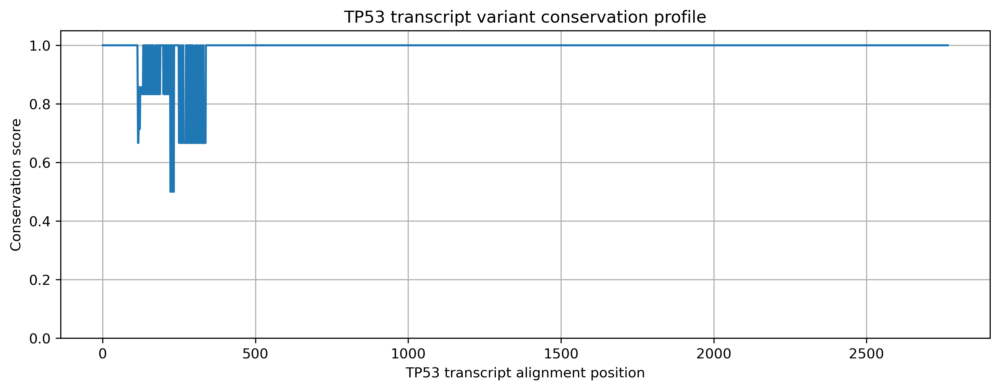
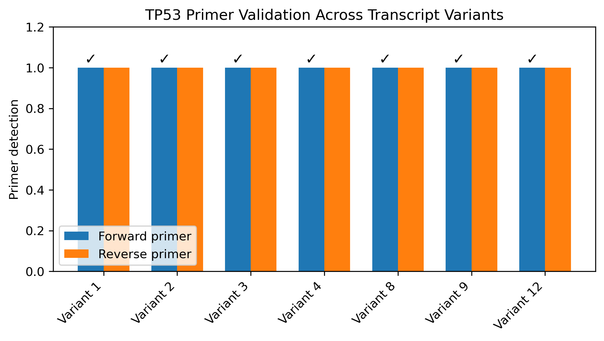

# TP53 Primer Design Across Transcript Variants

TP53 has many transcript variants, and a primer pair designed on just one of them might miss the others. In this project I tried to find a region shared by seven TP53 transcripts, design a primer pair inside it, and check *in silico* that the pair binds all seven and gives the same product.

## Transcripts

Seven human TP53 RefSeq mRNAs from NCBI:

| Accession | Transcript variant |
|---|---|
| NM_000546.6 | 1 |
| NM_001276761.3 | 2 |
| NM_001276696.3 | 3 |
| NM_001276695.3 | 4 |
| NM_001126118.2 | 8 |
| NM_001407262.1 | 9 |
| NM_001407269.1 | 12 |

## What I did

**1. Alignment.** The transcripts were aligned with Clustal Omega 

**2. Conservation.** For each alignment column I calculated the fraction of sequences carrying the most common base (gaps ignored). I then averaged it in 100-column windows to find stretches that are conserved across all seven transcripts.

**3. Template.** Alignment columns 401–700 were chosen as the primer design template, and a consensus sequence of that block was saved in `data/TP53_consensus_401_700.fasta`.

**4. Primer design. ** Primer3 was run on the consensus. with these settings: primer length 18–24 bp (optimum 20), Tm 57–63 °C (optimum 60), GC 40–60%, product 100–250 bp. Primer3 returned five pairs, and four of the five use the same forward primer. The final pair is `PRIMER_PAIR_2` (third by penalty score), which gives a 137 bp product.

**5. Validation.** Both primers were searched in every transcript (the reverse primer as its reverse complement). Primer-BLAST was used to check for off-target products.

## Result

| Primer | Sequence (5'→3') | Length | Tm | GC |
|---|---|---|---|---|
| Forward | TGAAGCTCCCAGAATGCCAG | 20 | 60.0 °C | 55% |
| Reverse | AGCTGCCCTGGTAGGTTTTC | 20 | 60.0 °C | 55% |

- Both primers match all 7 transcripts exactly, once each.
- The product is 137 bp in every transcript. In NM_000546.6 it covers positions 325–461 (c.183–c.319 of the coding sequence).
- Primer-BLAST found single-primer hits in some non-TP53 transcripts, but no off-target product in the expected size range.

  

## Things to keep in mind
- The validation looks for exact matches only, so "0 mismatches" just means the exact sequence was found. Partial matches aren't scored.
- Conservation is calculated with gaps ignored, so a column where only one or two transcripts have a base still scores 1.0.
- Everything here is computational. The primers haven't been tested in the lab.

  
